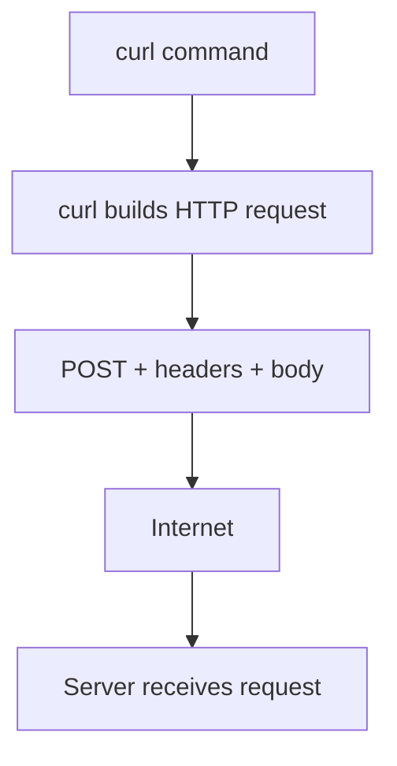

# curl Command Breakdown

Your command:

```bash
curl -X POST "https://c-and-cpp-projects.vercel.app/ask" \
  -H "Content-Type: application/json" \
  -d '{"code":"int main(){return 0;}","question":"What does this do?"}'
```

Is a command-line way of saying:

"Send an HTTP POST request with JSON data to this API endpoint."

Let's break down every piece.

## What is curl?

`curl` is a command-line HTTP client. It can:

- Send requests
- Upload files
- Call APIs
- Download webpages
- Test backend endpoints

Think of it as a terminal-based browser/API tester, except it shows raw responses instead of rendering webpages.

## Structure of your command

```text
curl
  -X POST
  URL
  -H "header"
  -d "data"
```

## 1. `curl`

Starts the `curl` program.

Without arguments:

```bash
curl https://google.com
```

It performs a simple GET request, equivalent to opening a webpage.

## 2. `-X POST`

Sets the HTTP method.

### What is `-X`?

`-X` means: use this HTTP request method.

Syntax:

```text
-X METHOD
```

Examples:

```text
-X GET
-X POST
-X PUT
-X DELETE
```

Your case:

```text
-X POST
```

Means "send a POST request" instead of the default GET.

### Common HTTP methods

| Method | Meaning |
| --- | --- |
| GET | Retrieve data |
| POST | Send/create data |
| PUT | Replace/update |
| PATCH | Partial update |
| DELETE | Remove data |
| OPTIONS | Ask allowed operations |

Example:

```bash
curl https://api.com/users
```

Means: "Give me users."

```bash
curl -X POST ...
```

Means: "I'm sending data to you."

### Important detail

When you use `-d`, `curl` often automatically switches to POST anyway. So these are usually equivalent:

```bash
curl -d '{"x":1}' URL
curl -X POST -d '{"x":1}' URL
```

Using `-X POST` just makes intent clearer.

## 3. The URL

```text
https://c-and-cpp-projects.vercel.app/ask
```

This tells `curl` where to send the request.

URL breakdown:

- `https://` = protocol (HTTPS encryption)
- `c-and-cpp-projects.vercel.app` = domain/server
- `/ask` = path/endpoint

## 4. `-H`

```text
-H "Content-Type: application/json"
```

Adds HTTP headers.

Headers are metadata about the request, like labels attached to a package.

Syntax:

```text
-H "Header-Name: value"
```

Your header:

```text
Content-Type: application/json
```

Means: "The request body contains JSON."

Without this header, the server may not parse the body correctly.

## 5. `-d`

```text
-d '{"code":"int main(){return 0;}","question":"What does this do?"}'
```

Sends request body data.

`-d` means data. It tells `curl`: "Include this data in the request body."

Your data:

```json
{
  "code": "int main(){return 0;}",
  "question": "What does this do?"
}
```

This becomes the HTTP body.

## Final HTTP request generated

Your curl command roughly becomes:

```http
POST /ask HTTP/1.1
Host: c-and-cpp-projects.vercel.app
Content-Type: application/json
Content-Length: 74

{"code":"int main(){return 0;}","question":"What does this do?"}
```

### What each part becomes

| curl part | HTTP equivalent |
| --- | --- |
| `-X POST` | `POST /ask HTTP/1.1` |
| `-H "Content-Type: application/json"` | HTTP header |
| `-d '{...}'` | Request body |
| URL | Destination server |

## Why is the backslash `\` used?

`\` means: "Continue command on the next line."

So these are the same:

**Multiline**

```bash
curl \
  -X POST \
  URL
```

**Single line**

```bash
curl -X POST URL
```

## What happens if you omit things?

- No `-X POST`: defaults to GET.
- No `-H`: server may not know the body is JSON and could fail parsing.
- No `-d`: request has no body, and your backend returns:

```json
{
  "error": "Both 'code' and 'question' are required."
}
```

## Important concept

`curl` is not special. It simply creates raw HTTP requests.

Frontend JavaScript `fetch()` does the same thing underneath.

### fetch equivalent

```js
fetch("https://c-and-cpp-projects.vercel.app/ask", {
  method: "POST",
  headers: {
    "Content-Type": "application/json"
  },
  body: JSON.stringify({
    code: "int main(){return 0;}",
    question: "What does this do?"
  })
});
```

## Visual mental model

